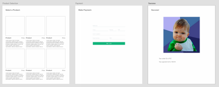
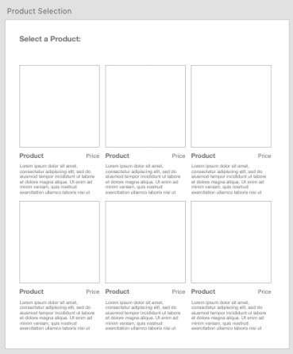
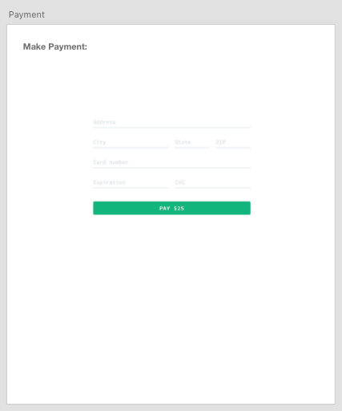
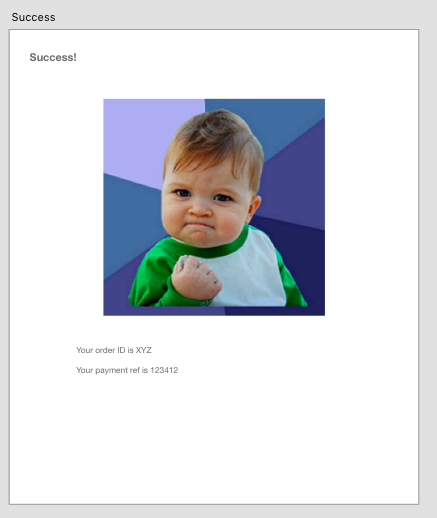

# Tinybeans Evaluation

**Congratulations on making it to the next round!** 


Download the contents of this repo, and complete the assignment according to the details below. 
Once complete, upload publicly to your Git provider of choice (Github/Gitlab/Bitbucket) and share the repository link with the tinybeans team.

## How to run it
This repo is setup using docker containers with docker-compose. To run it properly you will need 

- Docker VM installed on your machine
- Docker-Compose installed ( available via homebrew)

To start the app simply run the commands 
```
./gradlew clean build docker
docker-compose up --rebuild
```

NOTE: ports 3306 & 8080 must be available for it to run

After startup you can test that Spring Boot is running by going to `http://localhost:8080/test`
and if opting to use react you can verify its up and running by going to `http://localhost:3000/`

Both projects have `hot reload` capability, saving and/or recompiling a class will cause the docker project to reload


## Assignment

This repository is already setup using the following technologies:

- Spring boot
- MySQL 5.x
- Java 11


You’ll be making a web app with three screens: 




The requirements are

1. As a customer I want to see a list of products. 
2. As a customer I want to select a product to purchase. 
3. As a customer I want to pay for the product with my credit card. 
4. As a customer I want to see confirmation that I’ve paid for the product.


#### Product screen 



A model object for products has already been created for you in `com.tinybeans...data.entity.Item` 
You should populate this table using some test data, via the flyway integration or any other method you're comfortable with.
See [this link](https://medium.com/@jonashavers/how-to-create-database-test-data-for-spring-boot-applications-with-flyway-db-294a436db7ee) for inspiration

When the user clicks on a product it should take him to the checkout screen

#### Checkout screen 



When a user selects a product, that will get added to their cart, and the user can then place their order on this screen when ready to check out.

For this you can use a payment platform of your choice. Some popular options are
1. Stripe
2. Square
3. Google/Apple pay

Whichever you choose, make sure to include relevant api keys needed to checking out possible when you submit your work.


#### Success screen 



Once checkout has completed, an order is successfully placed we should save the details so we can review later. A model object for an order has already been created for you in `com.tinybeans...data.entity.Order`

The success screen should contain the Order ID and any reference to the payment made through the provider you chose in the checkout screen.


## Criteria for success

- Core backend complete
- Basic "frontend" complete with the screens above. Can be created in any way you're most comfortable ( JSP/JSF/Thymeleaf/React/etc )
- An updated README with any relevant details of your implementation needed to run it

Optional but major Bonus points
- A few unit/integration tests
- More polished code/UI


